# 菜谱制作清单

## 1. 基本信息

**菜名：** [菜谱名称]
**来源：** [菜谱来源]
**分析日期：** [YYYY-MM-DD]
**预估制作时间：** [分钟]
**预估难度：** [简单/中等/复杂]
**预估份量：** [几人份]

## 2. 色泽味道特征分析

### 色泽特征
- **主体颜色：** [主要颜色描述]
- **配菜点缀：** [点缀颜色描述]
- **整体视觉：** [视觉整体效果描述]

### 味道层次
- **主要味型：** [如：咸鲜、酸甜、麻辣等]
- **风味层次：** [前、中、后味的描述]
- **口感特点：** [脆、嫩、酥、滑等]

## 3. 食材清单与准备工作

### 主料
| 食材 | 用量 | 预处理要求 | 备注 |
|------|------|------------|------|
| [主料1] | [用量] | [预处理] | [备注] |
| [主料2] | [用量] | [预处理] | [备注] |

### 辅料
| 食材 | 用量 | 预处理要求 | 备注 |
|------|------|------------|------|
| [辅料1] | [用量] | [预处理] | [备注] |
| [辅料2] | [用量] | [预处理] | [备注] |

### 调味料详细用量表
| 调味料 | 用量 | 使用阶段 | 作用说明 | 可替代品 |
|--------|------|----------|----------|----------|
| [调味料1] | [精确用量] | [使用时机] | [作用] | [替代品] |
| [调味料2] | [精确用量] | [使用时机] | [作用] | [替代品] |

## 4. 详细制作方法（分阶段火候控制）

### 准备工作阶段（0-15分钟）
1. **食材处理：**
   - [具体操作]
   - [火候要求：无火/常温]
   - [时间：X分钟]

### 烹饪第一阶段（15-30分钟）
1. **初步加热：**
   - [具体操作]
   - **火候控制：** [小火/中火/大火，温度范围]
   - **时间控制：** [X分钟]
   - **关键观察点：** [需要观察的变化]

### 烹饪第二阶段（30-45分钟）
1. **主料烹饪：**
   - [具体操作]
   - **火候变化：** [从X火转Y火，时间控制]
   - **调味料加入时机：** [调味料名称及加入时间点]
   - **关键控制点：** [需要注意的事项]

### 烹饪第三阶段（45-60分钟）
1. **收尾阶段：**
   - [具体操作]
   - **最终火候：** [大火收汁/小火慢炖]
   - **最后调味：** [是否需要最后加盐/醋等]
   - **出锅标准：** [判断烹饪完成的标志]

## 5. 火候控制时间线

```mermaid
gantt
    title 菜谱烹饪火候时间线
    dateFormat  mm
    axisFormat %M分钟
    
    section 准备工作
    食材准备与预处理 :done, 0, 15
    厨房设备预热 :done, 10, 5
    
    section 烹饪阶段
    初步加热 (中火) :active, 15, 10
    主料烹饪 (大火转小火) : 25, 20
    调味加入 (中火) : 30, 5
    收汁阶段 (大火) : 45, 10
    
    section 完成阶段
    出锅装盘 : 55, 5
```

## 6. 厨房情况分析与建议

### 当前厨房条件假设
- **灶具类型：** 标准家用燃气灶（建议使用）
- **锅具要求：** [炒锅/炖锅/平底锅等]
- **主要工具：** [刀具、砧板、铲子等]
- **辅助设备：** [计时器、温度计等]

### 厨房准备建议
1. **前置准备：**
   - 清理工作台，确保操作空间充足
   - 准备好所有食材和调味料，按使用顺序摆放
   - 检查燃气供应和通风情况

2. **安全注意事项：**
   - [具体安全建议，如防烫伤、防火等]
   - 建议准备湿抹布或灭火器以备不时之需

3. **效率优化建议：**
   - **可以并行处理的任务：** [列出可以同时进行的步骤]
   - **时间节省技巧：** [提供节省时间的技巧]
   - **设备利用建议：** [如何更好地利用厨房设备]

### 厨房适应性与调整建议
1. **设备不足时的替代方案：**
   - 如果没有[X设备]，可以用[Y设备]替代
   - 如果灶火功率不同，建议调整：[具体调整建议]

2. **食材替代建议：**
   - 如果缺少[某食材]，可以用[替代品]代替
   - 根据季节调整的建议：[季节性调整]

3. **口味调整指导：**
   - 喜欢更辣：增加[辣椒]用量
   - 喜欢更甜：增加[糖]用量
   - 减少油腻：调整[油]的用量

## 7. 质量检查清单

### 烹饪过程中的检查点
- [ ] 食材预处理是否到位
- [ ] 调味料用量是否准确称量
- [ ] 火候控制是否符合时间要求
- [ ] 颜色变化是否正常
- [ ] 气味是否正常发展

### 完成后的质量标准
- **外观：** [应该呈现的颜色和形态]
- **气味：** [应该有的香气特征]
- **口感：** [应该达到的口感标准]
- **味道平衡：** [咸淡、酸甜等是否平衡]

## 8. 常见问题与解决方案

| 常见问题 | 可能原因 | 解决方案 |
|----------|----------|----------|
| [问题1] | [原因分析] | [解决方案] |
| [问题2] | [原因分析] | [解决方案] |

## 9. 存储与再加热建议

- **最佳食用时间：** 烹饪完成后[X]小时内
- **存储方法：** [冷藏/冷冻建议]
- **再加热方法：** [最佳再加热方式]
- **保存期限：** [冷藏X天，冷冻Y天]

---

**制作人备注：** [可根据具体菜谱添加额外说明]

**版本：** 1.0
**模板创建日期：** 2026-03-22